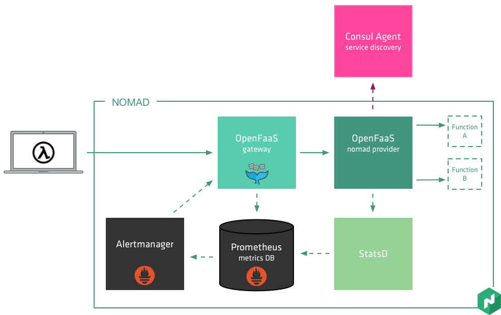
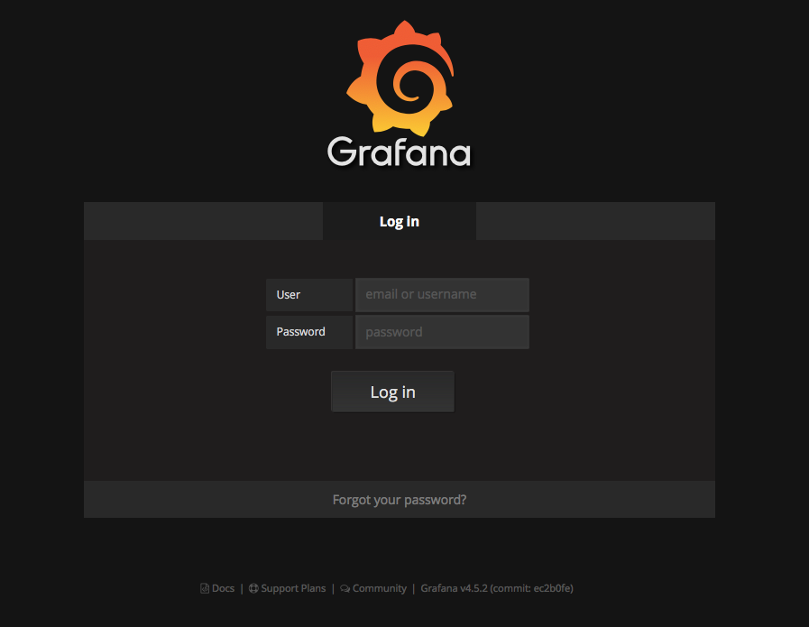
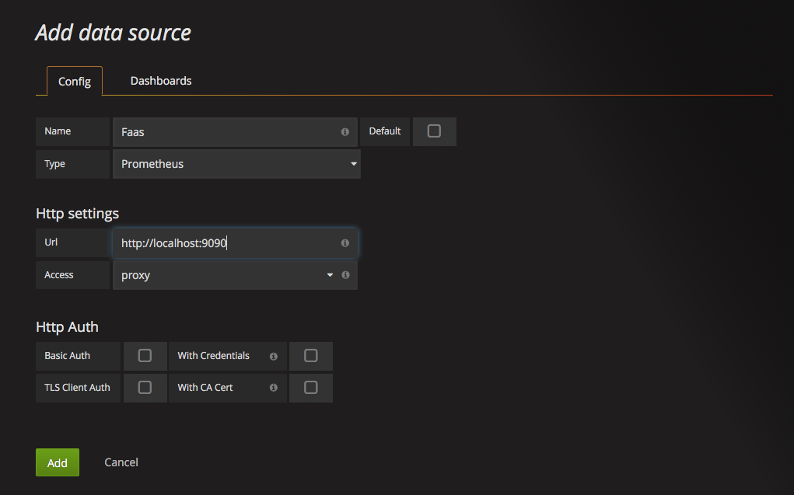
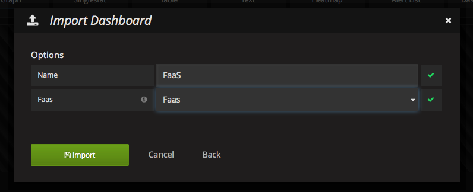
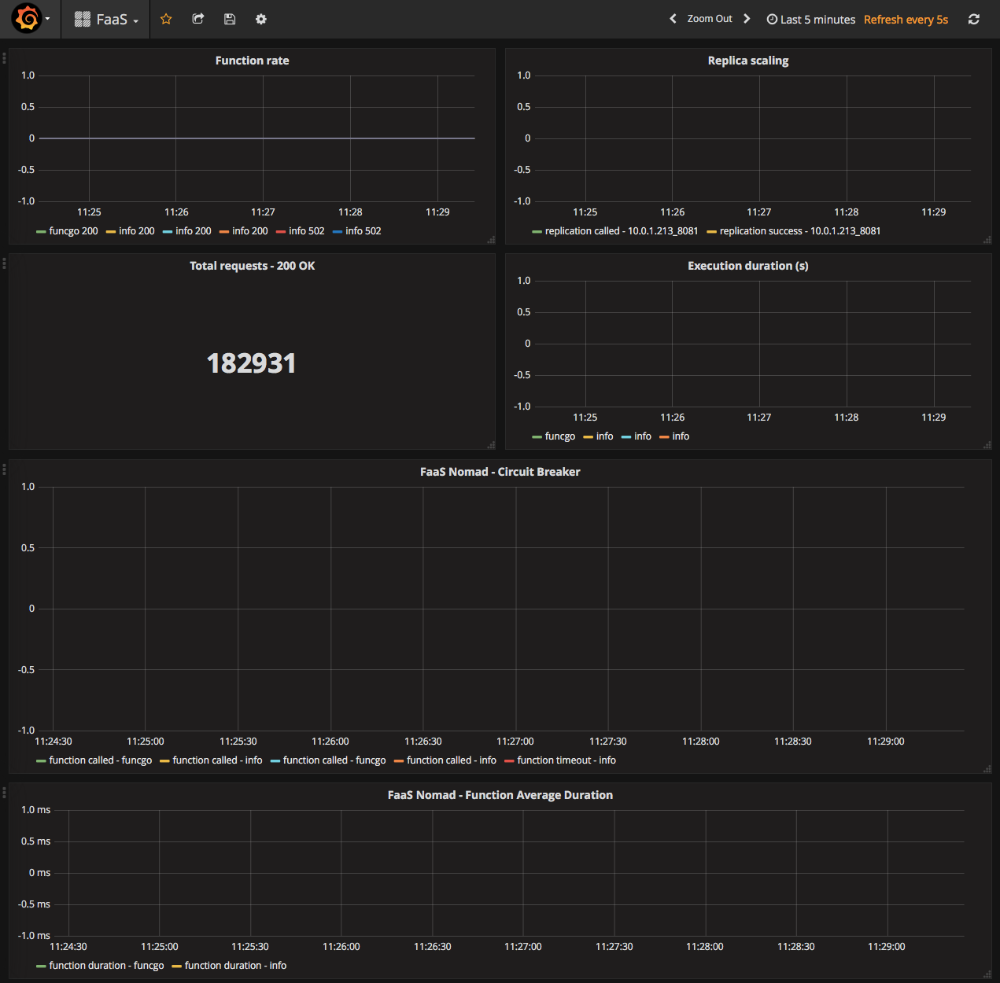

[](https://travis-ci.org/hashicorp/faas-nomad)
[](https://quay.io/repository/nicholasjackson/faas-nomad)
[](https://www.openfaas.com)
[](https://codeclimate.com/github/hashicorp/faas-nomad/maintainability)
[](https://codeclimate.com/github/hashicorp/faas-nomad/test_coverage)

# OpenFaaS - Nomad Provider
This repository contains the OpenFaaS provider for the Nomad scheduler.  OpenFaaS allows you to run your private functions as a service.  Functions are packaged in Docker Containers which enables you to work in any language and also interact with any software which can also be installed in the container.

## OpenFaaS Architecture
For the simplest installation, only two containers need to run on the Nomad cluster:
1. OpenFaaS Gateway
2. OpenFaaS Nomad provider
However for OpenFaaS to automatically scale your function based on inbound requests and to be able to gather metrics from the Nomad provider two additional containers are optionally run.
3. Prometheus DB
4. StatsD server for Prometheus
5. Grafana for querying Prometheus data




### OpenFaaS Gateway
The gateway provides a common API which is used by the command line of for deploying functions.  In addition to this it also hosts a Prometheus metrics endpoint which is used to provide operational metrics.  The gateway does not itself interact with the Nomad cluster instead it delegates all requests to the Nomad provider.  

### Nomad provider
The Nomad provider is responsible for performing any actions on the Nomad server such as deploying new functions or scaling functions.  Also it also acts as a function proxy.  Metrics such as execution duration and other information are emitted by the proxy and captured by the StatsD server.  Prometheus regularly collects this information from the StatsD server and stores it as time series data.

### OpenFaaS Functions
The functions performing the work on OpenFaaS are packaged as Docker images.  When running on the cluster these functions do not provide any external interface; instead, interactions are performed through the Nomad provider.  When a function is deployed, it is registered with Consul’s service catalog.  The provider uses this service catalog for service discovery to be able to locate and call the downstream function.

## Starting a local Nomad / Consul environment
First, ensure that you have a recent version of Nomad and Consul installed, the latest versions can be found at:  
[Consul Versions | HashiCorp Releases](https://releases.hashicorp.com/consul/)  
[Nomad Versions | HashiCorp Releases](https://releases.hashicorp.com/nomad/)

Make sure you download the correct architecture for your machine, binaries are available for most platforms, Mac, Windows, Linux, Arm, etc.

To get things up and running quickly you can run the bash script located in the root of this repository.

```bash
$ source ./startNomad.sh                                                                                                                                              
Discovered IP Address: 192.168.1.113                                                                                                                           
Starting Consul, redirecting logs to /Users/nicj/log/consul.log                                                                                                
Starting Nomad, redirecting logs to /Users/nicj/log/nomad.log                                                                                                  
NOMAD Running 
```

The startup script will set the advertised address to your primary local IP address and run both Nomad and Consul in the background redirecting the logs to your home folder.

## Starting a remote Nomad / Consul environment
If you would like to test OpenFaaS running on a cluster in AWS, a Terraform module and instructions can be found here:
[faas-nomad/terraform at master · hashicorp/faas-nomad · GitHub](https://github.com/hashicorp/faas-nomad/tree/master/terraform)

Regardless of which method you use interacting with OpenFaaS is the same.

## Running the OpenFaaS application
First, we need to start the OpenFaaS application, to do this there are two job files located in the folder `nomad_job_files` which set things up using sensible defaults.
To run the main application execute the following command:

```bash
$ nomad run ./nomad_job_files/faas.hcl

==> Monitoring evaluation "a3e54faa"
    Evaluation triggered by job "faas-nomadd"
    Allocation "28f60a54" created: node "867c6baa", group "faas-nomadd"
    Allocation "7223b65d" created: node "d196a533", group "faas-nomadd"
    Allocation "a4dbae6c" created: node "123e18c0", group "faas-nomadd"
    Evaluation status changed: "pending" -> "complete"
==> Evaluation "a3e54faa" finished with status "complete"
```

This job will start an instance of the OpenFaaS gateway and the Nomad provider on every node in the cluster.

We can then launch the monitoring job to start Prometheus and Grafana:

```bash
$ nomad run ./nomad_job_files/monitoring.hcl

==> Monitoring evaluation "7d9c46df"
    Evaluation triggered by job "faas-monitoring"
    Allocation "e20ace08" created: node "123e18c0", group "faas-monitoring"
    Evaluation status changed: "pending" -> "complete"
==> Evaluation "7d9c46df" finished with status "complete"
```

This job starts a single instance of Prometheus and Grafana on the Nomad cluster.

## Setting up Grafana to view application metrics
If you are not using the provided Terraform module, you will need to locate the node which Grafana is running on, assuming you have not changed the job file the port will be `3000`.
To log into Grafana use the default username and password `admin.`



Once you have successfully logged in, the next step is to create a data source for the Prometheus server.



Configure the options as shown ensuring that the URL points to the location of your Prometheus server.  The next step is to add a dashboard to view the data from the OpenFaaS gateway and provider.  A simple dash can be found at  `grafana\faas-dashboard.json`, let’s add this to Grafana.  Clicking the `Import` button from the `Dashboards` menu will pop up a box like the one below.  Choose the file for the example dashboard and press import.



Assuming all went well, you should now see the dashboard in Grafana:



## Creating and deploying a function
To create functions, we can install the `faas-cli` tool, to get the CLI tool you can run the following command:

```bash
$ curl -sL https://cli.openfaas.com | sudo sh
```

Alternately if you are using a Mac, the cli is also available via `brew install faas-cli`

### Creating a new function
Changing to a new folder we can create a new function by running the following command in the CLI:

```bash
$ faas-cli new gofunction -lang go
#...
2017/11/17 11:35:49 Cleaning up zip file...

Folder: gofunction created.
  ___                   _____           ____
 / _ \ _ __   ___ _ __ |  ___|_ _  __ _/ ___|
| | | | '_ \ / _ \ '_ \| |_ / _` |/ _` \___ \
| |_| | |_) |  __/ | | |  _| (_| | (_| |___) |
 \___/| .__/ \___|_| |_|_|  \__,_|\__,_|____/
      |_|


Function created in folder: gofunction
Stack file written: gofunction.yml
``` 

The command will create two folders and one file in the current directory:

```bash
$ tree -L 1  
.
├── gofunction
├── gofunction.yml
└── template

2 directories, 1 file
```

The `gofunction` folder is where the source code for your application will live by default there is the main entry point called `handler.go`:

```go
package function

import (
    "fmt"
)

// Handle a serverless request
func Handle(req []byte) string {
    return fmt.Sprintf("Hello, Go. You said: %s", string(req))
}
```

The Handle method receives the payload sent by calling the function as a slice of bytes and expects any output to be returned as a string.  For now, let’s keep this function the same and run through the steps for building the function.  The first thing we need to do is to edit the `gofunction.yml.` file and change the image name so that we can push this to a Docker repo that our Nomad cluster will be able to pull.  Also, change the gateway address to the location of your OpenFaaS gateway.  Changing the gateway in this file saves us providing the location as an alternate parameter.

```yaml
provider:
  name: faas
  gateway: http://localhost:8080

functions:
  gofunction:
    lang: go
    handler: ./gofunction
    image: nicholasjackson/gofunction
```

### Building our new function
Next step is to build the function; we can do this with the `faas-cli build` command:

```bash
$ faas-cli build -yaml gofunction.yml 
#...
Step 16/17 : ENV fprocess "./handler"
 ---> Using cache
 ---> 5e39e4e30c60
Step 17/17 : CMD ./fwatchdog
 ---> Using cache
 ---> 2ae72de493b7
Successfully built 2ae72de493b7
Successfully tagged nicholasjackson/gofunction:latest
Image: gofunction built.
[0] < Builder done.
```

The `build` command execute the Docker build command with the correct Dockerfile for your language.  All code is compiled inside of the container as a multi-stage build before being packaged into an Image.

### Pushing the function to the Docker repository
We can either use the `faas-cli push` command to push this to a Docker repo, or we can manually push.

```bash
$ faas-cli push -yaml gofunction.yml 
[0] > Pushing: gofunction.
The push refers to a repository [docker.io/nicholasjackson/gofunction]
cc9df684d32a: Pushed 
4e12ae9c1d69: Pushed 
cdcffb5144dd: Pushed 
10d64a26ddb0: Pushed 
dbbae7ea208f: Pushed 
2aebd096e0e2: Pushed 
latest: digest: sha256:57c0143772a1e6f585de019022203b8a9108c2df02ff54d610b7252ec4681886 size: 1574
[0] < Pushing done.
```

### Deploying the function
To deploy the function we can again use the `faas-cli` tool to deploy the function to our Nomad cluster:

```bash
$ faas-cli deploy -yaml gofunction.yml
Deploying: gofunction.
Removing old function.
Deployed.
URL: http://192.168.1.113:8080/function/gofunction

200 OK
```

If you run the `nomad status` command, you will now see the additional job running on your Nomad cluster.

```bash
$ nomad status
ID                   Type     Priority  Status   Submit Date
OpenFaaS-gofunction  service  1         running  11/17/17 11:52:59 GMT
faas-monitoring      service  50        running  11/15/17 14:43:11 GMT
faas-nomadd          system   50        running  11/15/17 11:00:31 GMT
```

### Running the function
To run the function, we can simply curl the OpenFaaS gateway and pass our payload as a string:
```bash
$ curl http://192.168.1.113:8080/function/gofunction -d 'Nic'
Hello, Go. You said: Nic
```

or you can use the cli

```bash
$ echo "Nic" | faas-cli --gateway http://192.168.1.113:8080/ invoke gofunction
```

That is all there is to it, checkout the OpenFaaS community page for some inspiration and other demos.
[faas/community.md at master · openfaas/faas · GitHub](https://github.com/openfaas/faas/blob/master/community.md)

### Datacenters
By default the Nomad provider will use a default datacenter for a deployed function of `dc1`, this can be overridden by setting the label `datacenters`, which takes a comma separated list of datacenters to deploy the funtion into.

i.e.
```bash
$ faas-cli deploy -l datacenters=dc1,dc2
```

or from a stack file...
```yaml
functions:
  facedetect:
    lang: go-opencv
    handler: ./facedetect
    image: nicholasjackson/func_facedetect
    limits:
      memory: 512
      cpu: 1000
    labels:
      datacentres: "dc1"
```

### Contributing
The application including docker containers is built using goreleaser [https://goreleaser.com](https://goreleaser.com).  

#### Setup
* Clone this repo: `go get github.com/hashicorp/faas-nomad`
* Create a fork in your own github account
* Add a new git remote to $GOPATH/src/hashicorp/faas-nomad with your fork `git remote add fork git@github.com:/yourname/faas-nomad.git`

#### Building the application
`make build_all` this runs the command `goreleaser -snapshot -rm-dist -skip-validate`

#### Testing the application
`make test` runs all unit tests in the application, for continuous test running try [http://goconvey.co](http://goconvey.co)
